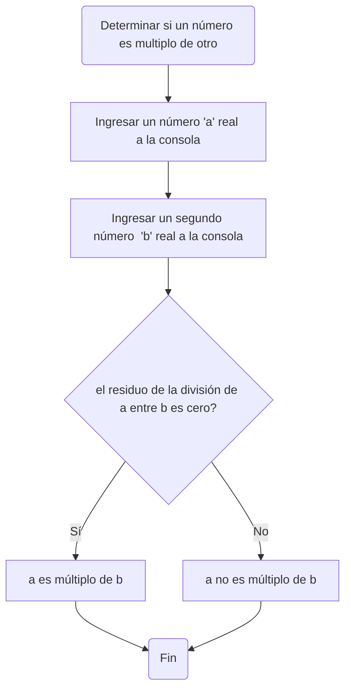

# **Taller 1** 
# **Grupo 7 Pecados de la Programacion**
### Programación de Computadores - UNAL

[](https://postimg.cc/QKpkbFcY)
=============

1. Realice el <a href="https://pythonspot.com/python-tests-quizes/">quiz</a> *Python Beginner Quiz* (20 preguntas) y adjunte pantallazo con el resultado (mínimo 90% bien).
![]
> Resultados quiz

[](https://postimg.cc/XpYpxZKZ)

2. Realice un programa que lea tres números reales y determine cuál es el mayor.
  > Extencion .py
```
primer_num=float(input("Ingrese el primer numero (real)"))
segundo_num=float(input("Ingrese el segundo numero (real)"))
tercer_num=float(input("Ingrese el tercer numero (real)"))

if primer_num!=segundo_num and primer_num!=tercer_num and tercer_num!=segundo_num:
    if primer_num>segundo_num and primer_num>tercer_num: #Se evalua el primer numero vs los otros dos
        print ("El primer "+str(primer_num)+" numero es mayor")
    elif segundo_num>primer_num and segundo_num>tercer_num: #Se evalua el segundo numero vs los otros dos
        print ("El segundo "+str(segundo_num)+" numero es mayor")
    else: #Si ambas funciones evaluadas no dan, por consiguiente el tercero debe ser el mayor
        print ("El tercer "+str(tercer_num)+" numero es mayor")
elif primer_num==segundo_num :
    if primer_num>tercer_num: #Se evalua el primer numero vs el tercero sabiendo que 1 y 2 son iguales
        print ("El primero y segundo "+str(primer_num)+"  son los mayores que el tercero")
    else:  #Se sabria que el tercero es el mayor
        print ("El tercer "+str(tercer_num)+"  numero es el mayor")
elif primer_num==tercer_num:  
    if primer_num>segundo_num: #Se evalua el primer numero vs el segund sabiendo que 1 y 3 son iguales
        print ("El primer y tercer "+str(tercer_num)+"  numero son mayores")
    else:  #Se sabria que el tercero es el mayor
        print ("El segundo "+str(segundo_num)+"  numero es el mayor")
elif segundo_num==tercer_num:  
    if segundo_num>primer_num: #Se evalua el segundo numero vs el primer sabiendo que 2 y 3 son iguales
     print ("El segundo y tercer "+str(segundo_num)+"  numero son mayores")
    else:  #Se sabria que el tercero es el mayor
        print ("El primer "+str(primer_num)+"  numero es el mayor")
```
3. Realice un programa que lea un número enteros y determine si es par o impar.
> Extencion .ipynb
`Queriamos añdir Notas de Junyper Directamente pero el proceso no nos funciono`

```
#Par or Impar
numero_evaluado=float(input("Ingrese numero entero: ")) #definiendo numero como float para evitar errores con inputs reales

calculo_par:float=numero_evaluado%2 #evaluado el numero y su modulo, si es par dara un modulo 0

if calculo_par==0: #Condicion para imprimir par o impar
    print("El numero "+str(numero_evaluado)+" es par")
else:
    print ("El numero "+str(numero_evaluado)+"  es impar")

```

###Diagrama de Flujo

```mermaid
flowchart TD;
    
```
4. Realice un programa que lea dos números reales y determine si el primero es múltiplo del segundo.
> Extencion .py

```
#programa que lea dos números reales y determine si el primero es múltiplo del segundo.

x: float
y: float
x = float(input("Ingrese un numero entero: "))
y = float(input("Ingrese un numero entero: "))
x >= y
if x%y==0:
    print ("es multiplo")
else:
   print ("no es multiplo")
```

###Diagrama de Flujo


5. Realice un programa que lea tres números reales y determine si la suma de los dos primeros es mayor, menor o igual que el tercer número.
> Extencion .ipynb
```
#programa que lea tres números reales y determine si la suma de los dos primeros es mayor, menor o igual que el tercer número.
n: float
x: float
y: float
n = float(input('Ingrese el primer numero '))
x = float(input('Ingrese un segundo numero '))
y = float(input('Ingrese el tercer numero '))

if n + x == y:
  print("La suma de " +str(n)+ " con "+str(x)+ " es igual a " +str(y))
else:
  if n + x > y:
    print("La suma de " +str(n)+ " con "+str(x)+ " es mayor a " +str(y))
  if n + x < y:
    print("La suma de " +str(n)+ " con "+str(x)+ " es menor a " +str(y))
```

6. Escriba un programa que solicite al usuario una letra y determine si es una vocal o una consonante.
> Extencion .py

```
#programa que solicite al usuario una letra y determine si es una vocal o una consonante.
letra_eval: int
letra_eval = (input("Ingrese letra :"))
n=letra_eval
if ord(n)== 97 or ord(n)==101 or ord(n)==105 or ord(n)==111 or ord(n)==117:
    print("Es vocal")
else:
    print("Es consonante")
```

7. Escriba un programa que pida 5 números reales y calcule las siguientes operaciones:
  + El promedio
  + La mediana 
  + El promedio multiplicativo (multilplica todos y luego calcula la raíz de la cantidad de operandos)
  + Ordenar los números de forma ascendente
  + Ordenar los números de forma descendente
  + La potencia del mayor número elevado al menor número
  + La raíz cúbica del menor número
> Extencion .ipynb

```
#frecuencia de una onda en hz y como salida arroje en que parte del espectro electromagnético se encuentra.
hz: int
hz = int(input("Ingrese la frecuencia de la onda en hz (hertz): "))
if hz > 30e+18:
  print("La onda pertenece a la región de rayos gamma")
elif hz > 30e+15:
  print("La onda pertenece a la región de rayos X")
elif hz > 1.5e+15:
  print("La onda es del ultravioleta extremo")
elif hz > 7.89e+14:
  print("La onda es del ultravioleta cercano")
elif hz > 384e+12:
  print("La onda es del espectro visible")
elif hz > 120e+12:
  print("La onda es del infrarrojo cercano")
elif hz > 6e+12:
  print("La onda es del infrarrojo medio")
elif hz > 300e+9:
  print("La onda es del infrarrojo lejano")
elif hz > 3e+8:
  print("La onda es una microonda")
elif hz > 300e+6:
  print("La onda es de Ultra Alta Frecuencia")
elif hz > 30e+6:
  print("La onda es de muy alta frecuencia y de radio")
elif hz > 1.7e+6:
  print("La onda es corta y de radio")
elif hz > 650e+3:
  print("La onda es media y de radio")
elif hz > 30e+3:
    print("La onda es larga y de radio")
else:
    print("La onda es de muy baja frecuencia")
```

8. Escriba un programa al que se le ingrese la frecuencia de una onda en *hz* y como salida arroje en que parte del <a href="https://es.wikipedia.org/wiki/Espectro_electromagn%C3%A9tico">espectro electromagnético se encuentra</a>.
> Extencion .py


###Diagrama de Flujo

```mermaid
flowchart TD;
    
```
9. Escriba un programa que reciba el nombre en minúsculas de un país de **America** y retorne la ciudad capital, si el país no pertenece al continente debe arrojar *país no identificado*.
> Extencion .ipynb
10. Escriba un programa que dada una distancia calcule:
+ El tiempo que le tomaría a la luz recorrer la distancia.
+ El tiempo que le tomaría al sonido (en el aire) recorrer la distancia.
+ El tiempo que le tomaría al vehiculo comercial más veloz recorrer la distancia.
+ El tiempo que le tomaría a Bolt recorrer la distancia.
> Extencion .py


