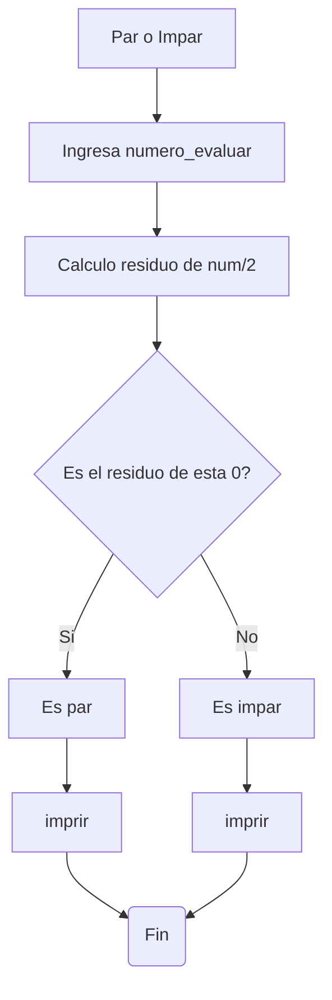
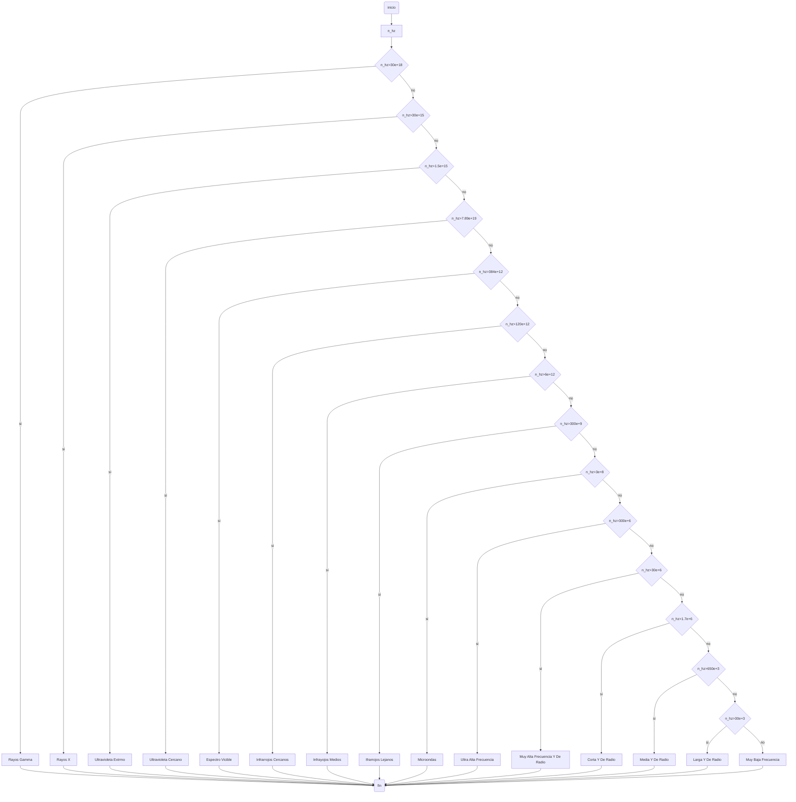

# **Taller 1** 
# **Grupo 7 Pecados de la Programacion**
### Programación de Computadores - UNAL

[](https://postimg.cc/QKpkbFcY)
=============

1. Realice el <a href="https://pythonspot.com/python-tests-quizes/">quiz</a> *Python Beginner Quiz* (20 preguntas) y adjunte pantallazo con el resultado (mínimo 90% bien).
![]
> Resultados quiz

[](https://postimg.cc/XpYpxZKZ)

2. Realice un programa que lea tres números reales y determine cuál es el mayor.
  > Extencion .py
 
Despues de definir cada input, primero se lleva a una comparacion en la cual ningun numero ingresado es igual, asi se define el mayor exclusivo.

Para la segunda tabla, donde hay uno o mas iguales, se compara cuuales son iguales y si son igual si estos son mayores o menores que el numero restante.

```
primer_num=float(input("Ingrese el primer numero (real)"))
segundo_num=float(input("Ingrese el segundo numero (real)"))
tercer_num=float(input("Ingrese el tercer numero (real)"))

if primer_num!=segundo_num and primer_num!=tercer_num and tercer_num!=segundo_num:
    if primer_num>segundo_num and primer_num>tercer_num: #Se evalua el primer numero vs los otros dos
        print ("El primer "+str(primer_num)+" numero es mayor")
    elif segundo_num>primer_num and segundo_num>tercer_num: #Se evalua el segundo numero vs los otros dos
        print ("El segundo "+str(segundo_num)+" numero es mayor")
    else: #Si ambas funciones evaluadas no dan, por consiguiente el tercero debe ser el mayor
        print ("El tercer "+str(tercer_num)+" numero es mayor")
elif primer_num==segundo_num :
    if primer_num>tercer_num: #Se evalua el primer numero vs el tercero sabiendo que 1 y 2 son iguales
        print ("El primero y segundo "+str(primer_num)+"  son los mayores que el tercero")
    else:  #Se sabria que el tercero es el mayor
        print ("El tercer "+str(tercer_num)+"  numero es el mayor")
elif primer_num==tercer_num:  
    if primer_num>segundo_num: #Se evalua el primer numero vs el segund sabiendo que 1 y 3 son iguales
        print ("El primer y tercer "+str(tercer_num)+"  numero son mayores")
    else:  #Se sabria que el tercero es el mayor
        print ("El segundo "+str(segundo_num)+"  numero es el mayor")
elif segundo_num==tercer_num:  
    if segundo_num>primer_num: #Se evalua el segundo numero vs el primer sabiendo que 2 y 3 son iguales
     print ("El segundo y tercer "+str(segundo_num)+"  numero son mayores")
    else:  #Se sabria que el tercero es el mayor
        print ("El primer "+str(primer_num)+"  numero es el mayor")
```
3. Realice un programa que lea un número enteros y determine si es par o impar.
> Extencion .ipynb
`Queriamos añdir Notas de Junyper Directamente pero el proceso no nos funciono`

Despues de tomar el numero, se hace un calculo de residuo, con la variable del residuo, se puede comprobar si es par o impar dado que un par tendra residuo 0

```
#Par or Impar
numero_evaluado=float(input("Ingrese numero entero: ")) #definiendo numero como float para evitar errores con inputs reales

calculo_par:float=numero_evaluado%2 #evaluado el numero y su modulo, si es par dara un modulo 0

if calculo_par==0: #Condicion para imprimir par o impar
    print("El numero "+str(numero_evaluado)+" es par")
else:
    print ("El numero "+str(numero_evaluado)+"  es impar")

```

### Diagrama de Flujo


4. Realice un programa que lea dos números reales y determine si el primero es múltiplo del segundo.
> Extencion .py

```
#programa que lea dos números reales y determine si el primero es múltiplo del segundo.

x: float
y: float
x = float(input("Ingrese un numero entero: "))
y = float(input("Ingrese un numero entero: "))
x >= y
if x%y==0:
    print ("es multiplo")
else:
   print ("no es multiplo")
```

### Diagrama de Flujo


```mermaid
flowchart TD;
    A(Determinar si un número es multiplo de otro)
    A-->B[Ingresar un número 'a' real a la consola];
    B -->C[Ingresar un segundo número  'b' real a la consola];
    C-->D{el residuo de la división de a entre b es cero?}
    D --Sí--> E[a es múltiplo de b]
    D --No --> F[a no es múltiplo de b]
    E-->G(Fin)
    F-->G;
```

5. Realice un programa que lea tres números reales y determine si la suma de los dos primeros es mayor, menor o igual que el tercer número.
> Extencion .ipynb

Inicialmente, se declaran las variables que seran ingresadas en la consola como numeros reales, posterior a ello se les hace la conversion de cadena de texto a flotante (real) ya que lo que ingrese a consola sera entendido como string y debe pasarse a numero, con la adicion de un mensaje que instruira al usuario a ingresar los numeros. 

Por otra parte, se establecen los condicionales debidos: si la suma de los dos primeros numeros es igual al tercero ingresado, imprimir que esto, si no se cumple, verificar si la suma des estos dos primeros numeros, es mayor o menor al tercero.

```
#programa que lea tres números reales y determine si la suma de los dos primeros es mayor, menor o igual que el tercer número.
n: float
x: float
y: float
n = float(input('Ingrese el primer numero '))
x = float(input('Ingrese un segundo numero '))
y = float(input('Ingrese el tercer numero '))

if n + x == y:
  print("La suma de " +str(n)+ " con "+str(x)+ " es igual a " +str(y))
else:
  if n + x > y:
    print("La suma de " +str(n)+ " con "+str(x)+ " es mayor a " +str(y))
  if n + x < y:
    print("La suma de " +str(n)+ " con "+str(x)+ " es menor a " +str(y))
```

6. Escriba un programa que solicite al usuario una letra y determine si es una vocal o una consonante.
> Extencion .py

Despues de tomar el input de la letra, se define otra vaiable con el mismo valor, la cual es evaluada con `ord` para ver si coincide con el codigo ASCII de las vocales.

```
#programa que solicite al usuario una letra y determine si es una vocal o una consonante.
letra_eval: int
letra_eval = (input("Ingrese letra :"))
n=letra_eval
if ord(n)== 97 or ord(n)==101 or ord(n)==105 or ord(n)==111 or ord(n)==117:
    print("Es vocal")
else:
    print("Es consonante")
```

7. Escriba un programa que pida 5 números reales y calcule las siguientes operaciones:
  + El promedio
  + La mediana 
  + El promedio multiplicativo (multilplica todos y luego calcula la raíz de la cantidad de operandos)
  + Ordenar los números de forma ascendente
  + Ordenar los números de forma descendente
  + La potencia del mayor número elevado al menor número
  + La raíz cúbica del menor número
> Extencion .ipynb

```
# Ingresar 5 números
a = float(input("Ingrese el número a: "))
b = float(input("Ingrese el número b: "))
c = float(input("Ingrese el número c: "))
d = float(input("Ingrese el número d: "))
e = float(input("Ingrese el número e: "))

f=(a+b+c+d+e)/5
m1=a
m2=b
m3=c
m4=d
m5=e

if m1 > m2:
    m1, m2 = m2, m1
    if m1 > m3:
        m1, m3 = m3, m1
    if m1 > m4:
        m1, m4 = m4, m1
    if m1 > m5:
        m1, m5 = m5, m1

if m2 > m3:
    m2, m3 = m3, m2
    if m2 > m4:
        m2, m4 = m4, m2
    if m2 > m5:
        m2, m5 = m5, m2

if m3 > m4:
    m3, m4 = m4, m3
    if m3 > m5:
        m3, m5 = m5, m3

if m4 > m5:
    m4, m5 = m5, m4

    

mediana = m3  

g=m5**m1

r=m1**(1/3)

r2=(a*b*c*d*e)**(1/5)

print("el promedio es:", f)
print("La mediana es:", mediana)
print("el promedio multiplicatovo es: " + str(r2))
print("los numeros de menor a mayor son:", m1, m2, m3, m4, m5)
print("los numeros de mayor a menor son:", m5, m4, m3, m2, m1 )
print("la potencia de " + str(m5) + " a la " + str(m1) + " es: " + str(g))
print("la Raíz Cubica de " + str(m1) + " es: " + str(r))
```

8. Escriba un programa al que se le ingrese la frecuencia de una onda en *hz* y como salida arroje en que parte del <a href="https://es.wikipedia.org/wiki/Espectro_electromagn%C3%A9tico">espectro electromagnético se encuentra</a>.
> Extencion .py

Se declara la variable de la frecuencia de onda como entero y enseguida, se establece la linea para que el usuario ingrese un valor de frecuencia de onda en Hertz y, se hace la conversion de la cadena de texto ingresada a numero entero. Seguidamente, se establecen varios condicionales, de acuerdo a los intervalos de frecuencia de onda clasificados en el espectro electromagentico, es decir, segun el valor ingresado por el usuario, se clasificara el tipo de onda. Los condicionales utilizados fueron if-elif-else, de manera que, el primer condicional, si no se cumple, pasa hacia el siguiente que es elif, el cual si se cumple, imprime el string correspondiente, pero si no cumple ninguna condicion 'sino si' (elif) se pasa al else (entonces) e imprime el resultado.


```
#frecuencia de una onda en hz y como salida arroje en que parte del espectro electromagnético se encuentra.
hz: int
hz = int(input("Ingrese la frecuencia de la onda en hz (hertz): "))
if hz > 30e+18:
  print("La onda pertenece a la región de rayos gamma")
elif hz > 30e+15:
  print("La onda pertenece a la región de rayos X")
elif hz > 1.5e+15:
  print("La onda es del ultravioleta extremo")
elif hz > 7.89e+14:
  print("La onda es del ultravioleta cercano")
elif hz > 384e+12:
  print("La onda es del espectro visible")
elif hz > 120e+12:
  print("La onda es del infrarrojo cercano")
elif hz > 6e+12:
  print("La onda es del infrarrojo medio")
elif hz > 300e+9:
  print("La onda es del infrarrojo lejano")
elif hz > 3e+8:
  print("La onda es una microonda")
elif hz > 300e+6:
  print("La onda es de Ultra Alta Frecuencia")
elif hz > 30e+6:
  print("La onda es de muy alta frecuencia y de radio")
elif hz > 1.7e+6:
  print("La onda es corta y de radio")
elif hz > 650e+3:
  print("La onda es media y de radio")
elif hz > 30e+3:
    print("La onda es larga y de radio")
else:
    print("La onda es de muy baja frecuencia")
```

### Diagrama de Flujo


9. Escriba un programa que reciba el nombre en minúsculas de un país de **America** y retorne la ciudad capital, si el país no pertenece al continente debe arrojar *país no identificado*.
> Extencion .ipynb

"Tabla" de los paises comparando el str inicial con cada pais en la "tabla".

Si no entra en ninguna país de America, se lanza como no identificado por default.

```
#Taller_1_Punto_9
nacion=(input("Ingrese un país de America en minusculas (sensible a tildes y espacios) :"))
if str(nacion)== str("antigua y barbuda"):
    print("Su capital es :"" Saint John’s")
elif str(nacion)== str("argentina"):
    print("Su capital es :"" Buenos Aires")
elif str(nacion)== str("bahamas"):
    print("Su capital es :"" Nasáu")
elif str(nacion)== str("barbados"):
    print("Su capital es :"" Bridgetown")
elif str(nacion)== str("belice"):
    print("Su capital es :"" Belmopán")
elif str(nacion)== str("bolivia"):
    print("Su capital es :"" Sucre")
elif str(nacion)== str("brasil"):
    print("Su capital es :"" Brasilia")    
elif str(nacion)== str("canadá"):
    print("Su capital es :"" Ottawa")
elif str(nacion)== str("chile"):
    print("Su capital es :"" Santiago")
elif str(nacion)== str("colombia"):
    print("Su capital es :"" Bogotá")
elif str(nacion)== str("costa Rica"):
    print("Su capital es :"" San José")
elif str(nacion)== str("cuba"):
    print("Su capital es :"" La Habana")
elif str(nacion)== str("dominica"):
    print("Su capital es :"" Roseau")
elif str(nacion)== str("ecuador"):
    print("Su capital es :"" Quito")
elif str(nacion)== str("el salvador"):
    print("Su capital es :"" San Salvador ")
elif str(nacion)== str("estado unidos"):
    print("Su capital es :"" Washington D. C.")
elif str(nacion)== str("granada"):
    print("Su capital es :"" Saint George")
elif str(nacion)== str("guatemala"):
    print("Su capital es :"" Ciudad de Guatemala")
elif str(nacion)== str("guyana"):
    print("Su capital es :"" Georgetown")
elif str(nacion)== str("haití"):
    print("Su capital es :"" Puerto Príncipe")
elif str(nacion)== str("honduras"):
    print("Su capital es :"" Tegucigalpa")
elif str(nacion)== str("jamaica"):
    print("Su capital es :"" Kingston")
elif str(nacion)== str("méxico"):
    print("Su capital es :""  Ciudad de México")
elif str(nacion)== str("nicaragua"):
    print("Su capital es :"" Managua")
elif str(nacion)== str("panamá"):
    print("Su capital es :"" Ciudad de Panamá ")
elif str(nacion)== str("paraguay"):
    print("Su capital es :"" Asunción ")
elif str(nacion)== str("perú"):
    print("Su capital es :"" Lima")
elif str(nacion)== str("república dominicana"):
    print("Su capital es :""  Santo Domingo")
elif str(nacion)== str("san cristóbal y nieves"):
    print("Su capital es :"" Basseterre ")
elif str(nacion)== str("san vicente y las granadinas"):
    print("Su capital es :"" Kingstown")
elif str(nacion)== str("santa lucia"):
    print("Su capital es :"" Castries")
elif str(nacion)== str("surinam"):
    print("Su capital es :"" paramaribo")
elif str(nacion)== str("trinidad y tobago"):
    print("Su capital es :""  Puerto España")
elif str(nacion)== str("uruguay"):
    print("Su capital es :"" Montevideo")
elif str(nacion)== str("venezuela"):
    print("Su capital es :"" Caracas")
else :
    print("país no identificado")

``` 
10. Escriba un programa que dada una distancia calcule:
+ El tiempo que le tomaría a la luz recorrer la distancia.
+ El tiempo que le tomaría al sonido (en el aire) recorrer la distancia.
+ El tiempo que le tomaría al vehiculo comercial más veloz recorrer la distancia.
+ El tiempo que le tomaría a Bolt recorrer la distancia.
> Extencion .py

Se toma el valor del input con metros y se define como real.

Se definen y calculan los diferenctes calculos a presentar.
Y se imprimen.

```
#Taller_1_Punto_10
distancia: float #distancia ingresada en metros
velocidadLuz: int = 300000000 #m/s
velocidadSonido: int = 344 #m/s
velocidadVehiculo: float = 141.11 #m/s
velocidadBolt: float = 12.5 #m/s
distancia = float(input('Ingrese una distancia en metros ')) #usuario ingresa valor de distancia y se hace la conversion a real
tiempoLuz: float = distancia / velocidadLuz  #calculo del tiempo a partir de la distancia y velocidad 
tiempoSonido: float = distancia / velocidadSonido
tiempoVehiculo: float = distancia / velocidadVehiculo
tiempoBolt: float = distancia / velocidadBolt

print("El tiempo que le tomaría a la luz recorrer " +str(distancia)+ " metros es de " +str(tiempoLuz)+ " segundos" )
print("El tiempo que le tomaría al sonido recorrer " +str(distancia)+ " metros es de " +str(tiempoSonido)+ " segundos" )
print("El tiempo que le tomaría al vehiculo mas veloz recorrer" +str(distancia)+ " metros es de " +str(tiempoVehiculo)+ " segundos" )
print("El tiempo que le tomaría a Usain Bolt recorrer " +str(distancia)+ " metros es de " +str(tiempoBolt)+ " segundos" )

```

7. Escriba un programa que pida 5 números reales y calcule las siguientes operaciones usando una función para cada una:
  + El promedio
  + La mediana 
  + El promedio multiplicativo (multilplica todos y luego calcula la raíz de la cantidad de operandos)
  + Ordenar los números de forma ascendente
  + Ordenar los números de forma descendente
  + La potencia del mayor número elevado al menor número
  + La raíz cúbica del menor número
  + 
```
def calcular_promedio(a, b, c, d, e):
    return (a + b + c + d + e) / 5

def calcular_mediana(a, b, c, d, e):
    numeros_ordenados = sorted([a, b, c, d, e])
    n = len(numeros_ordenados)
    if n % 2 == 0:
        return (numeros_ordenados[n//2 - 1] + numeros_ordenados[n//2]) / 2
    else:
        return numeros_ordenados[n//2]

def calcular_promedio_multiplicativo(a, b, c, d, e):
    producto = a * b * c * d * e
    return producto**(1/5)

def ordenar_ascendentemente(a, b, c, d, e):
    return sorted([a, b, c, d, e])

def ordenar_descendentemente(a, b, c, d, e):
    return sorted([a, b, c, d, e], reverse=True)

def calcular_potencia_mayor_menor(a, b, c, d, e):
    numeros_ordenados = sorted([a, b, c, d, e])
    return numeros_ordenados[-1] ** numeros_ordenados[0]

def calcular_raiz_cubica_menor(a, b, c, d, e):
    numeros_ordenados = sorted([a, b, c, d, e])
    return numeros_ordenados[0] ** (1/3)

if __name__ == "__main__":
    a = float(input("Ingrese el número a: "))
    b = float(input("Ingrese el número b: "))
    c = float(input("Ingrese el número c: "))
    d = float(input("Ingrese el número d: "))
    e = float(input("Ingrese el número e: "))

    print(f"Promedio: {calcular_promedio(a, b, c, d, e)}")
    print(f"Mediana: {calcular_mediana(a, b, c, d, e)}")
    print(f"Promedio multiplicativo: {calcular_promedio_multiplicativo(a, b, c, d, e)}")
    print(f"Orden ascendente: {ordenar_ascendentemente(a, b, c, d, e)}")
    print(f"Orden descendente: {ordenar_descendentemente(a, b, c, d, e)}")
    print(f"Potencia mayor-menor: {calcular_potencia_mayor_menor(a, b, c, d, e)}")
    print(f"Raíz cúbica del menor número: {calcular_raiz_cubica_menor(a, b, c, d, e)}")
```

8. Para el punto anterior incluir las funciones en un archivo independiente e importarlas para su uso.
